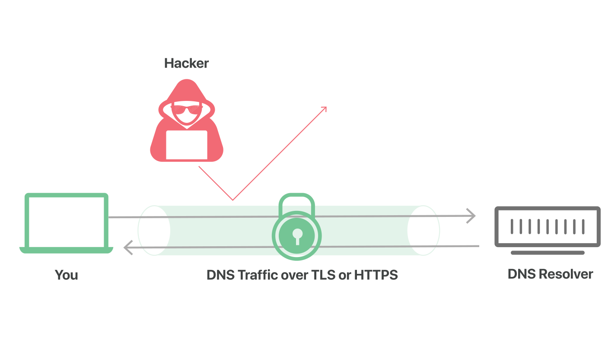

## 为什么 DNS 需要额外的安全层？

DNS 是互联网的电话簿；DNS 解析器将人类可读的域名转换为机器可读的 IP 地址。默认情况下，DNS 查询和响应以明文形式（通过 UDP 发送，这意味着它们可以被网络、ISP 或任何能够监视传输的人读取。即使网站使用 HTTPS，也会显示导航到该网站所需的 DNS 查询。

这种隐私上的欠缺对安全有着巨大影响，在某些情况下也会影响人权；如果 DNS 查询不是私密的，则政府可以更轻松地审查互联网，而不良行为者也可以跟踪用户的网上行为。

未经加密的普通 DNS 查询可以比作通过邮件发送的明信片：处理邮件的任何人都可能瞥见背面写的文字，因此邮寄包含敏感或私密信息的明信片不是明智的做法。

基于TLS 的 DNS 和基于 HTTPS 的 DNS 是为加密明文 DNS 流量而开发的两个标准，可以防止恶意方、广告商、ISP 和其他人解读其数据。继续上面的比喻，这些标准的目的是将邮寄的明信片放在信封内，以便任何人都可以寄送明信片，而不必担心有人窥探到明信片的内容。

## 什么是基于 TLS 的 DNS？

基于 TLS 的 DNS 或 DoT 是加密 DNS 查询以确保其安全和私密的一项标准。DoT 使用安全协议 TLS，这与 HTTPS 网站用来加密和认证通信的协议相同。（TLS 也称为 SSL。DoT 在用于 DNS 查询的用户数据报协议（UDP）的基础上添加了 TLS 加密。此外，它确保 DNS 请求和响应不会被中间人攻击篡改或伪造。

## 什么是基于 HTTPS 的 DNS？

基于 HTTPS 的 DNS 或 DoH 是 DoT 的替代标准。使用 DoH 时，DNS 查询和响应会得到加密，但它们是通过 HTTP或 HTTP/2 协议发送，而不是直接通过 UDP 发送。与 DoT 一样，DoH 也能确保攻击者无法伪造或篡改 DNS 流量。从网络管理员角度来看，DoH 流量表现为与其他 HTTPS 流量一样，如普通用户与网站和 Web 应用进行的交互。

## 等等，HTTPS 不也是将 TLS 用于加密的？基于 HTTPS 的 DNS 和基于 TLS 的 DNS 有何区别？

这两项标准都是单独开发的，并且各有各的 RFC* 文档，但 DoT 和 DoH 之间最重要的区别是它们使用的端口。DoT 仅使用端口 853，DoH 则使用端口 443，后者也是所有其他HTTPS 流量使用的端口。

由于 DoT 具有专用端口，因此即使请求和响应本身都已加密，具有网络可见性的任何人都发现来回的 DoT 流量。DoH 则相反，DNS 查询和响应在某种程度上伪装在其他 HTTPS 流量中，因为它们都是从同一端口进出的。

** RFC 代表“征求意见”，RFC 是开发人员、网络专家和思想领袖为标准化互联网技术或协议而进行的集体尝试。*

## 什么是端口？

在网络中，端口是计算机上的虚拟位置，开放给来自其他计算机的连接。每台联网计算机都有标准数量的端口，并且每个端口都保留用于特定类型的通信。

这可以比作港口中船舶的泊位：每个运输泊位都有编号，不同种类的船舶应该要前往特定的运输泊位来卸货或下客。网络中同样如此：某些类型的通信应该前往特定的网络端口。区别在于网络端口是虚拟的；它们是用于数字连接而非物理连接的地方。

## DoT 和 DoH 哪个更好？

这有待商榷。从网络安全的角度来看，DoT 可以说是更好的。它使网络管理员能够监视和阻止 DNS 查询，这对于识别和阻止恶意流量非常重要。另一方面，DoH 查询隐藏在常规 HTTPS 流量中；这意味着，若不阻止所有其他 HTTPS 流量，很难阻止它们。

但从隐私角度来看，DoH 可以说是更可取的。使用 DoH 时，DNS 查询隐藏在较大的 HTTPS 流量中。这削弱了网络管理员的可见性，但增强了用户的隐私性。

## 基于 TLS/HTTPS DNS 和 DNSSEC 之间有何区别？

DNSSEC 是一组安全扩展，用于验证与DNS 解析器通信时DNS 根服务器和权威名称服务器的身份。它旨在防止*DNS 缓存中毒*以及其他攻击，不会加密通信。另一方面，基于 TLS 或 HTTPS 的 DNS 会对 DNS 查询进行加密。

## 可用提供商

*因为众所周知的原因,境外服务的速度会有较大影响

* [AlibabaDNS](https://alidns.com/)
* [Tencent DNSPOD](https://www.dnspod.cn/Products/Public.DNS) (2020.8.1 服务仍在有限公测,未public)