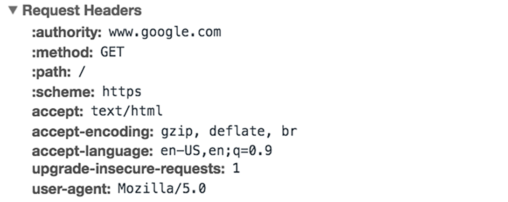
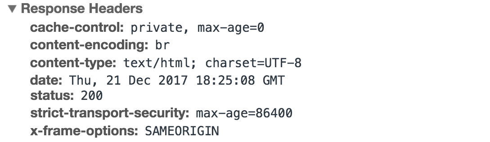

1. 1. ## 什么是 HTTP？

   2. 超文本传输协议（HTTP）是万维网的基础，用于通过超文本链接加载网页。HTTP 是应用程序层协议，旨在在联网设备之间传输信息，并在网络协议栈的其他层之上运行。HTTP 上的典型流涉及客户端计算机向服务器发出请求，然后服务器发送响应消息。

   3. ## 什么是 HTTP 请求？

   4. HTTP 请求是 Internet 通信平台（例如 Web 浏览器）索取其加载网站所需信息的方式。

   5. 在 Internet 上发出的每个 HTTP 请求都携带一系列编码数据，这些数据带有不同类型的信息。典型的 HTTP 请求包含如下信息：

   6. 1. HTTP 版本类型
      2. URL
      3. HTTP 方法
      4. HTTP 请求标头
      5. 可选的 HTTP 正文。

   7. 我们来更深入地探讨这些请求的工作方式，以及如何使用请求的内容来共享信息。

   8. #### 什么是 HTTP 方法？

   9. HTTP 方法（有时称为 HTTP 动词）指示 HTTP 请求对所查询服务器的期望操作。例如，最常见的两种 HTTP 方法是“GET”和“POST”。“GET”请求期望返回信息（通常以网站的形式），而“POST”请求通常表示客户端正在向 Web 服务器提交信息（例如表单信息，如提交的用户名和密码）。

   10. #### 什么是 HTTP 请求标头？

   11. HTTP 标头包含存储在键值对中的文本信息，并且它们包含在每个 HTTP 请求中（以及响应中，详见下文）。这些标头可传达核心信息，如客户端正在使用什么浏览器以及正在请求什么数据。

   12. 来自 Google Chrome 网络标签页的 HTTP 请求标头示例：

   13. 

   14. #### 什么是 HTTP 请求正文？

   15. 请求正文是包含请求所传输信息的“主体”的部分。HTTP 请求的正文包含正在提交到 Web 服务器的任何信息，例如用户名和密码，或输入到表单中的任何其他数据。

   16. ## HTTP 响应中包含什么？

   17. HTTP 响应是 Web 客户端（通常是浏览器）从 Internet 服务器收到的用于响应 HTTP 请求的内容。这些响应根据 HTTP 请求中的要求传达有价值的信息。

   18. 典型的 HTTP 响应包含：

   19. 1. HTTP 状态代码

       2. HTTP 响应标头

       3. 可选的 HTTP 正文

       4. 让我们分解一下：

       5. #### 什么是 HTTP 状态代码？

       6. HTTP 状态代码是 3 位数代码，最常用于指示 HTTP 请求是否已成功完成。状态代码分为以下 5 个区块：

       7. 1. 1xx 信息性
          2. 2xx 成功
          3. 3xx Redirection
          4. 4xx 客户端错误
          5. 5xx 服务器错误
          6. “xx”表示 00 到 99 之间的不同数字

          7. 以数字“2”开头的状态代码表示成功。例如，在客户端请求网页后，最常见的响应状态码为“200 OK”，这表示请求已正确完成。

          8. 如果响应以“4”或“5”开头，则表示存在错误，并且不会显示网页。以“4”开头的状态代码表示客户端错误（在 URL 中打错字时，经常会遇到“404 NOT FOUND”状态代码）。以“5”开头的状态代码表示服务器端出了问题。状态码也可以以“1”或“3”开头，分别表示信息响应和重定向。

          9. #### 什么是 HTTP 响应标头？

          10. 与 HTTP 请求非常相似，HTTP 响应也带有标头，用于传达重要的信息，例如在响应正文中发送的数据的语言和格式。

          11. 来自 Google Chrome 网络标签页的 HTTP 响应标头示例：

          12. 

          13. #### 什么是 HTTP 响应正文？

          14. 成功回应“GET”请求时，HTTP 响应通常具有包含所请求信息的正文。在大多数 Web 请求中，这是 HTML 数据，Web 浏览器会将其转换为网页。

          15. ## 是否可以通过 HTTP 发动 DDoS 攻击？

          16. 请记住，HTTP 是“无状态”协议，这意味着每个命令都独立于任何其他命令运行。在初始的规范中，HTTP 请求会各自创建并关闭一个 TCP 连接。在更新版本的 HTTP 协议（HTTP 1.1 及更高版本）中，持久连接允许多个 HTTP 请求通过一个持久 TCP 连接传递，从而改善资源消耗。在DoS或 DDoS 攻击中，大量 HTTP 请求可被用于对目标设备发起攻击，并可被视为应用程序层攻击或第 7 层攻击的一部分。